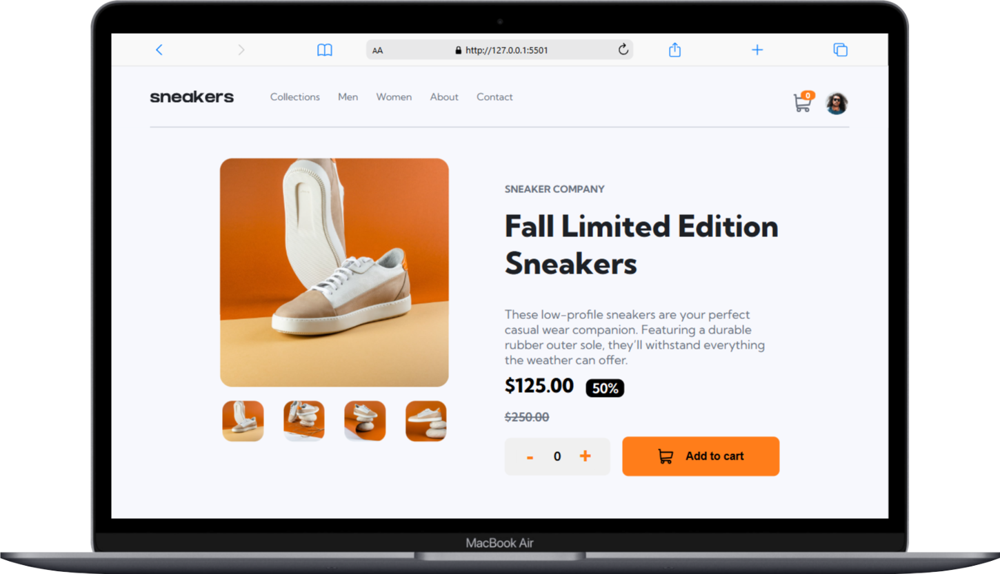

# 🛒 E-commerce Product Page
## 📜 Descrição

O projeto E-commerce Product Page é uma página interativa de um produto de e-commerce, permitindo aos usuários visualizar imagens do produto, ajustar quantidades e adicionar itens ao carrinho de compras. Este projeto ajudou a aprimorar habilidades essenciais em HTML, CSS e JavaScript, incluindo manipulação do DOM, eventos, acessibilidade e design responsivo.
O sistema oferece uma interface intuitiva e responsiva, tornando a experiência do usuário fluida tanto em dispositivos móveis quanto em desktops.

## 🌟 Funcionalidades

✔ Menu de navegação responsivo 
✔ Alteração dinâmica das imagens do produto 
✔ Controle de quantidade de produtos 
✔ Adição de produtos ao carrinho 
✔ Modal do carrinho interativo 
✔ Feedback visual para ações do usuário 
✔ Design responsivo para diferentes tamanhos de tela 

## 💻 Tecnologias Utilizadas

 
  
  
  

## 🎯 Como Usar

Clone o repositório
git clone https://github.com/seu-usuario/ecommerce-product-page.git

## 📂 Estrutura do Projeto

📁 ecommerce-product-page 
│── 📁 assets 
│   │── 📁 images       &nbsp; ==> Imagens do produto e ícones 
│   │── 📁 style        &nbsp; ==> Arquivos CSS para estilos e responsividade 
│   │── 📁 script       &nbsp; ==> Arquivos JavaScript para funcionalidades 
│── 📄 index.html       &nbsp; ==> Estrutura principal da página 
│── 📄 README.md        &nbsp; ==> Documentação do projeto 

##3🛠 Principais Recursos Implementados

1️⃣ Menu Mobile
Um menu responsivo que se abre e fecha com animação.
Uso do evento de clique para alternar a visibilidade do menu.
Implementação de acessibilidade com aria-expanded.

2️⃣ Sistema de Imagens Dinâmicas
Alteração da imagem principal ao passar o mouse sobre as miniaturas.
Botões de navegação para alternar entre as imagens.

3️⃣ Carrinho de Compras
Exibição de itens no carrinho com quantidade e valor total.
Ícone do carrinho atualizado dinamicamente com a quantidade de produtos.
Remoção de itens do carrinho ao clicar no ícone de lixeira.

4️⃣ Modal Interativo
Modal para exibir os produtos adicionados ao carrinho.
Efeito de abertura suave com fundo escuro.
Possibilidade de fechar o modal ao clicar fora dele ou pressionar ESC.

5️⃣ Responsividade
Adaptação do layout para diferentes tamanhos de tela.
Implementação de media queries para ajuste automático do conteúdo.

## 📸 Demonstração

## 🖥️ Versão Desktop

## 📱Versão Mobile

## 🏆 Créditos 
Desenvolvido por João Victor Almeida.  
Inspirado em um desafio do Frontend Mentor.
